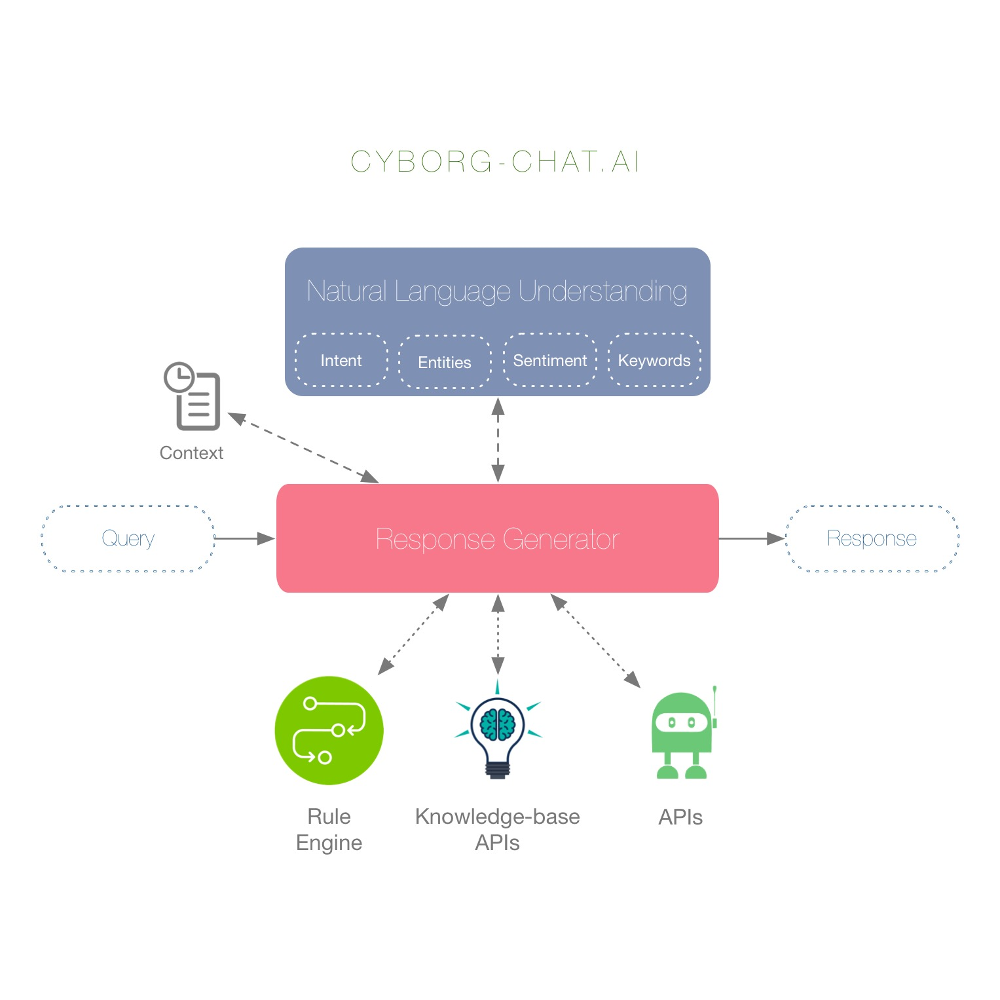

# NLU Engine for ChatBot

## Architecture


## Cyborg NLU APIs

1. Upload training data to server
    > `curl -X POST http://10.63.108.116:8888/upload -F 'file=@data_file_name.json'`

2. Train your model on uploaded dataset
    > `curl -X POST http://10.63.108.116:8888/ner -d '{ "data_file": "data_file_name", "train": "True" }'`

3. Predict using train model

    > `curl -X POST http://10.63.108.116:8888/ner -d '{ "data_file": "data_file_name", "text": "this is the text I want to predict on."}'`
4. Keyword API

    > `curl -X POST http://10.63.108.116:8888/keyword -d '{ "text": "Can I claim benefits for both the own property and rented accommodation?"}'`
 
    ```   
    {
        "clean_text": "claim benefits property rented accommodation",
        "important_phrases": [
            "property",
            "accommodation"
        ],
        "sentiment": "neutral",
        "nouns": [
            "claim",
            "benefits",
            "property",
            "accommodation"
        ],
        "norm_text": "can i claim benefits for both own property and rented accommodation?"
    }
    ```


## Setting up your own server
1. Install *Anaconda Python* v4.3.1 for Python 2.7

    **Linux**
        
    > `wget https://repo.continuum.io/archive/Anaconda2-4.3.1-Linux-x86_64.sh`
        
    > `bash Anaconda2-4.3.1-Linux-x86_64.sh -b`
    
    **MacOS**
    
    > `wget https://repo.continuum.io/archive/Anaconda2-4.3.1-MacOSX-x86_64.pkg`

    > `echo 'export PATH="/home/USERNAME/anaconda2/bin:$PATH"' >> ~/.bashrc && source ~/.bashrc`
        
    
2. Install llvm or clang-omp and gcc if not installed

    > `brew install --with-clang --with-lld --with-python --HEAD llvm --force`
    
    > `sudo yum install gcc gcc-c++ clan`
    
    > `sudo apt install gcc clang llvm`


3. Symbolic linking of clang to llvm clang for further installation in MacOS
    > `mkdir -p /usr/local/Cellar/clang-omp/2015-04-01/libexec/bin/clang`
    
    > `ln -s /usr/local/opt/llvm/bin/clang-5.0 /usr/local/Cellar/clang-omp/2015-04-01/libexec/bin/clang`
 
4. Install all requirement

    > `./install.sh`
    
    > `cp /path/to/total_word_feature_extractor.dat rasa_nlu/data`
    
5. Create necessary folders

    > `touch resources/modelDB.json & echo '{}' > resources/modelDB.json`
    
    > `mkdir -p rasa_nlu/data/cyborg`
   
6. Install Nodejs, npm and **Rasa-NLU-Trainer**

    > `brew install node`
    
    > `npm i -g rasa-nlu-trainer`
    
    > `rasa-nlu-trainer --source data/examples/rasa/demo-rasa.json`
    
